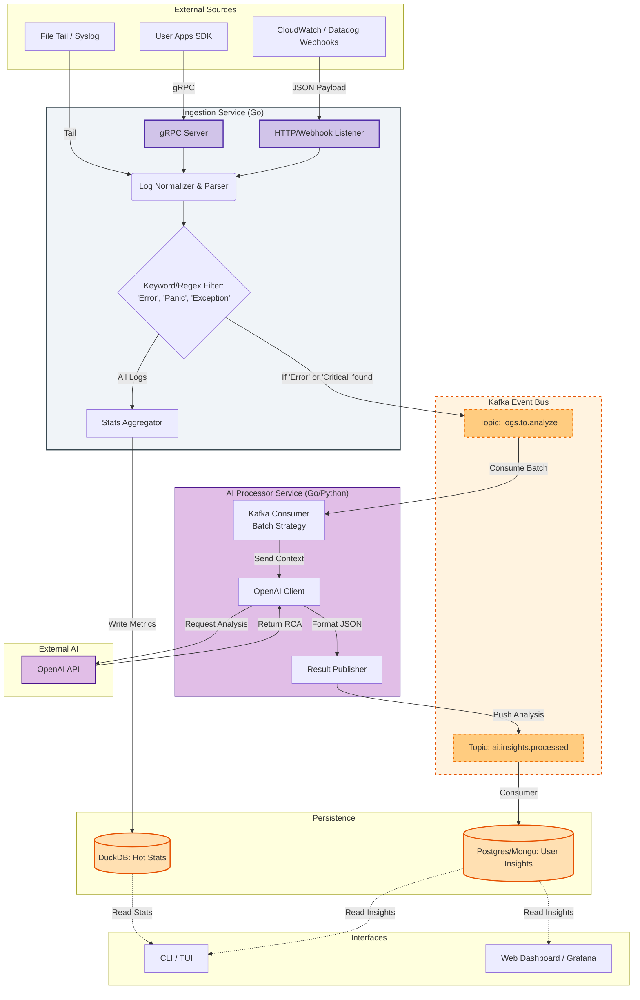
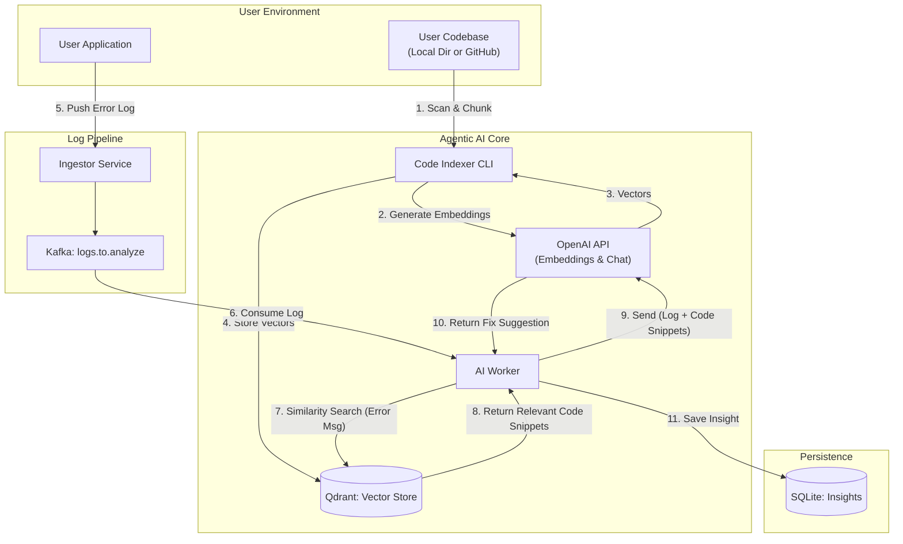
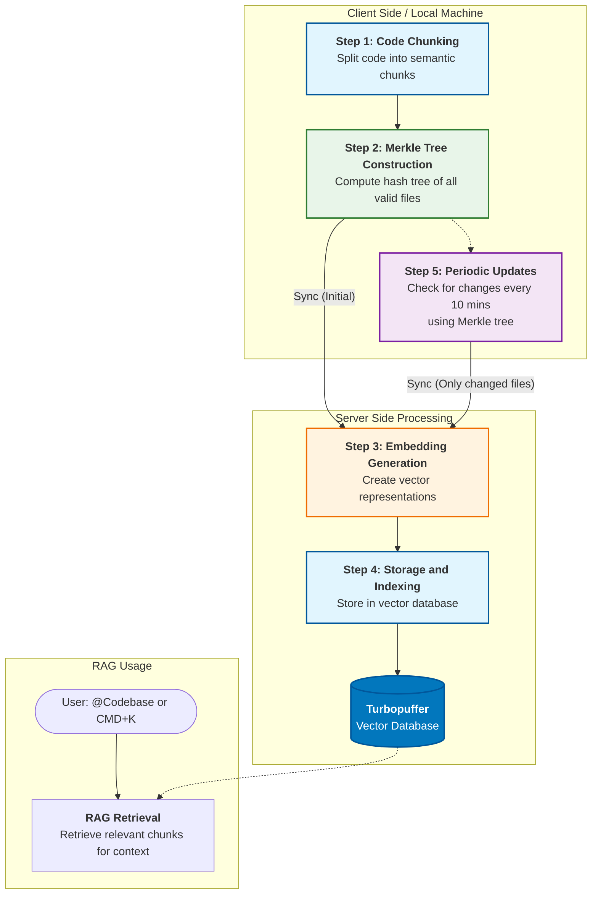

## System Architecture (Mermaid)

# 🔍 Log Insight (AI-Powered Log Analysis Platform)

A distributed, event-driven log analysis platform that ingests logs from various sources (Files, Datadog, HTTP), processes them through an AI Worker (LLM) to identify root causes, and displays real-time insights in a TUI dashboard.

## 🏗 Architecture So Far
The system acts as a pipeline with three distinct components:

1.  **Ingestor Service (Go)**
    * Listens for logs via HTTP (Datadog Webhooks) or internal generators.
    * Normalizes data into a standard `LogEntry` format.
    * Pushes critical/error logs to a **Kafka** topic (`logs.to.analyze`).
    * *Status:* ✅ Working (Handles Datadog Webhooks & Manual Curls).
    - [ ] **gRPC Server:** Add a gRPC handler to the Ingestor for high-performance internal logging.
    - [ ] **Database:** Migrate from `insights.jsonl` to SQLite or DuckDB.

2.  **AI Worker (Go)**
    * Consumes messages from Kafka.
    * (Currently) Mocks AI analysis or connects to OpenAI.
    * Saves analyzed insights to a local storage file (`insights.jsonl`).
    * *Status:* ✅ Working (Consumes & Saves).

3.  **CLI Dashboard (Bubbletea TUI)**
    * Reads from storage (`insights.jsonl`).
    * Displays a navigable, interactive list of error logs and their AI-generated root causes.
    * *Status:* ✅ Working (Basic view).
    * Added polling to the CLI so new alerts appear without restarting the app.

---

## 🎯 End Goal
To build an "Agentic" Observability Platform that doesn't just show logs, but **understands** them.
* **True Agentic Behavior:** RPC agents sitting on user servers pushing logs directly.
* **Real Intelligence:** OpenAI/LLM analyzing complex stack traces.
* **Custom workflows and recreating the issues:** here once the domain system receveis an error devs can setup custom workflows that will run to recover the issue , recreting and reassuring the issue and other triggers and stuff people worked on that part of the system agets triggered sand stuff like maybe n8n flows.
* **Production Storage:** Replacing flat files with high-performance DBs (DuckDB/ClickHouse).

---

## ✅ To-Do List (Next Steps)

### Phase 1: Robustness (Immediate)
- [ ] **Real AI Connection:** Switch Worker from "Mock Analysis" to real OpenAI API calls.

### Phase 2: Agentic Expansion
- [ ] **SDK:** Build a tiny Go SDK that developers can import to send logs to us automatically.

### Phase 3: Infrastructure
- [ ] **Dockerize:** Create a full `docker-compose` for the Ingestor, Worker, and DB.

---

## 🚀 Quick Start
1. **Start Infrastructure:** `docker-compose up` (Kafka/Zookeeper)
2. **Start Ingestor:** `go run cmd/ingestor/main.go`
3. **Start Worker:** `go run cmd/worker/main.go`
4. **Start Tunnel:** `ngrok http 8080` (for Datadog)
5. **View Dashboard:** `go run cmd/cli/main.go`

Agentic Debugger

Flow for creating embeddings [High]

